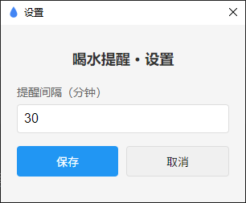

<p align="center">
  
</p>

<h1 align="center">💧 喝水提醒</h1>

<p align="center">
  一个轻量的桌面喝水提醒工具，常驻系统托盘，定时弹出提醒，帮你养成健康饮水习惯。
</p>

<p align="center">
  
  
  
</p>

---

## ✨ 功能

- 🖥️ **系统托盘常驻** — 最小化到托盘，不打扰工作
- ⏰ **定时弹窗提醒** — 可自定义提醒间隔（1–120 分钟）
- 🚀 **开机自启** — 系统启动时自动运行，无需手动打开
- 🔔 **单实例运行** — 防止重复启动
- ⚙️ **轻量配置面板** — 简洁的设置界面，随时调整间隔
- 📦 **零依赖运行时** — 基于 Electron，打包后独立运行

## 📸 截图

<!-- 替换为实际截图 -->
<!--  -->
<!--  -->

> 提示：可以使用 GreenShot、ShareX 等工具截图后放入 `screenshots/` 目录。

## 🚀 快速开始

### 环境要求

- [Node.js](https://nodejs.org/) >= 18
- npm >= 9

### 安装与运行

```bash
# 克隆仓库
git clone https://github.com/yourusername/drink-water-reminder.git
cd drink-water-reminder

# 安装依赖
npm install

# 启动应用
npm start
```

### 打包为可执行文件

```bash
# Windows
rm -rf dist && ELECTRON_MIRROR="https://npmmirror.com/mirrors/electron/" npx @electron/packager . "喝水提醒" --platform=win32 --arch=x64 --out=dist --overwrite --icon=water.ico --extra-resource=water.png

# macOS
rm -rf dist && npx @electron/packager . "喝水提醒" --platform=darwin --arch=x64 --out=dist --overwrite --icon=water.png --extra-resource=water.png

# Linux
rm -rf dist && npx @electron/packager . "喝水提醒" --platform=linux --arch=x64 --out=dist --overwrite --extra-resource=water.png
```

> 💡 国内用户可通过 `ELECTRON_MIRROR` 环境变量使用 npmmirror 镜像加速下载。

## 🛠️ 技术栈

| 技术 | 说明 |
|------|------|
| [Electron](https://www.electronjs.org/) | 跨平台桌面框架 |
| [@electron/packager](https://github.com/electron/packager) | Electron 打包工具 |

## 📁 项目结构

```
.
├── main.js            # Electron 主进程
├── package.json       # 项目配置
├── water.png          # 托盘/弹窗图标
├── water.ico          # Windows 打包图标
└── README.md
```

## 🤝 贡献

欢迎提交 Issue 和 Pull Request！

1. Fork 本仓库
2. 创建特性分支 (`git checkout -b feature/amazing-feature`)
3. 提交更改 (`git commit -m 'feat: add amazing feature'`)
4. 推送到分支 (`git push origin feature/amazing-feature`)
5. 创建 Pull Request

## 📄 许可证

本项目基于 [MIT](LICENSE) 许可证开源。

---

<p align="center">
  Made with ❤️ for healthy habits
</p>
